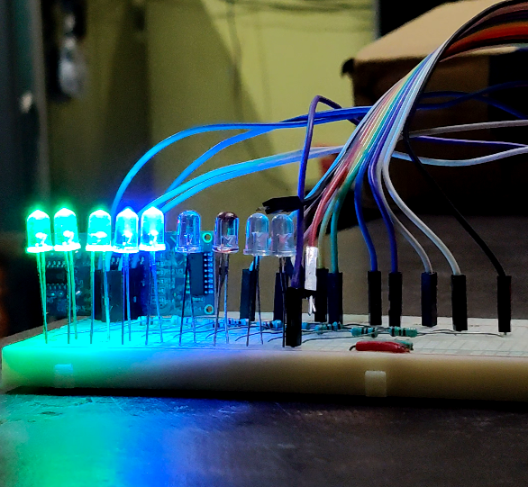
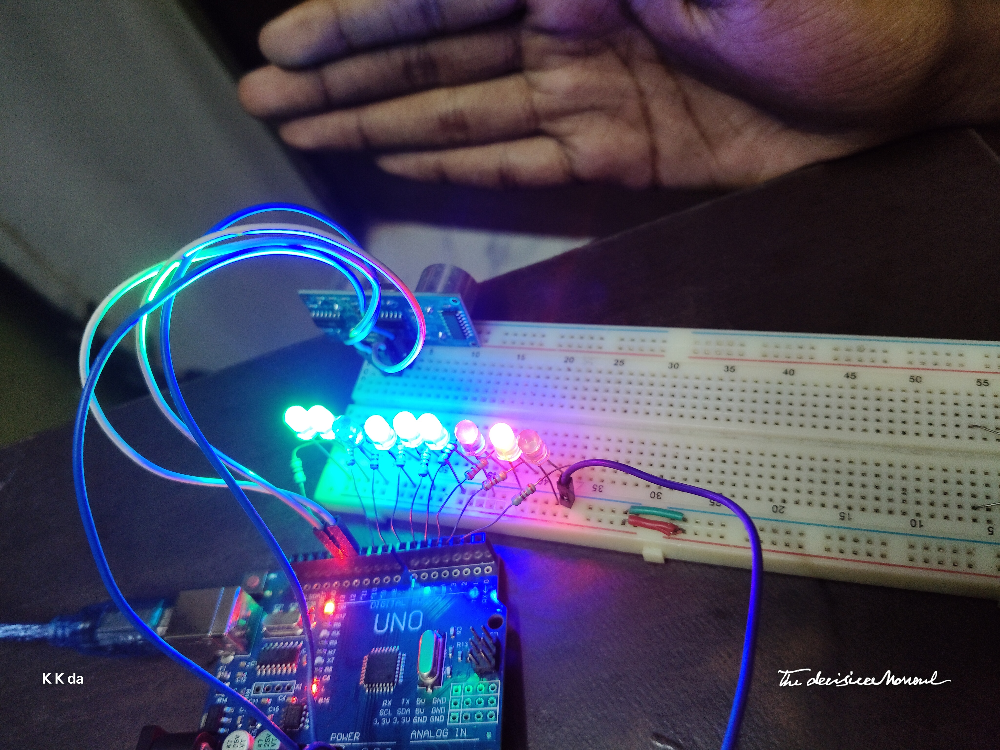
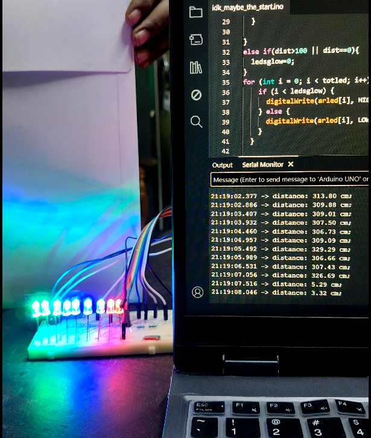
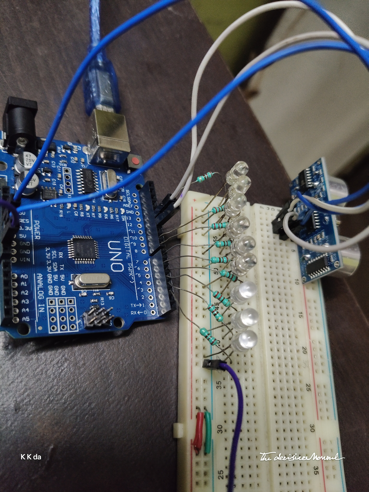
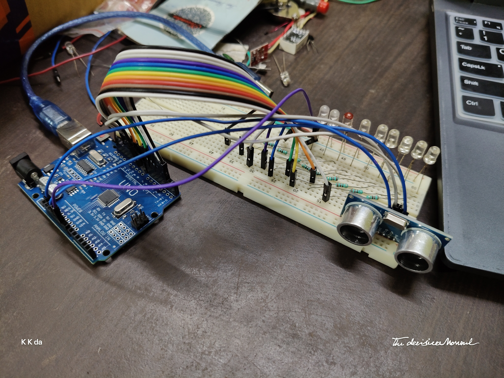
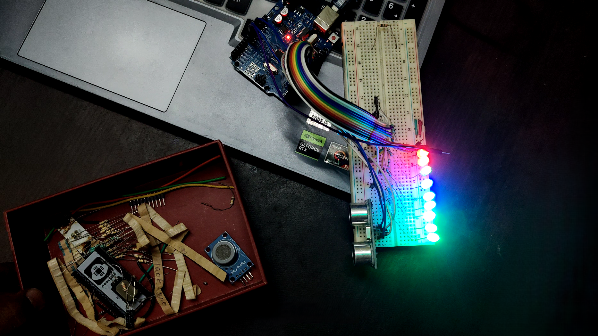
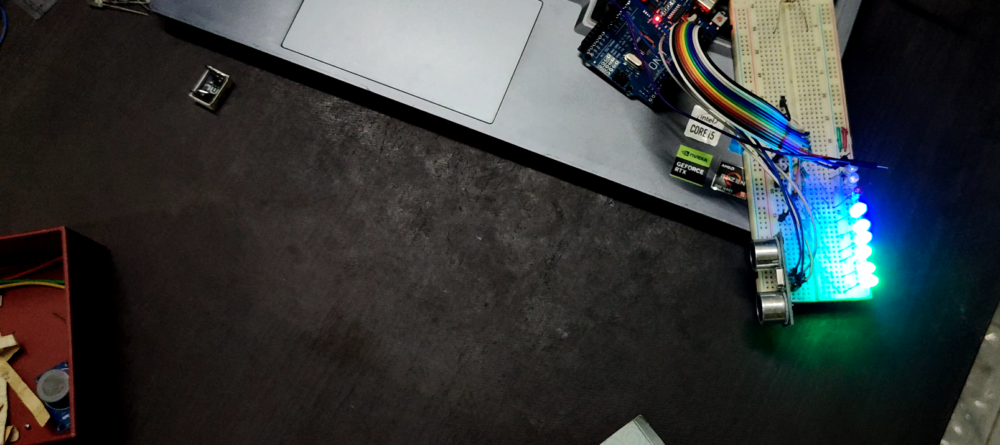
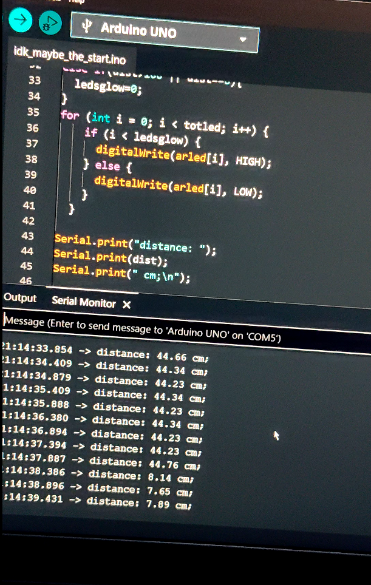

# Ultrasonic Distance Visual Indicator

A simple Arduino-based distance indicator using an HC-SR04 ultrasonic sensor.
Instead of displaying the measured distance only through the Serial Monitor,
the project uses 9 LEDs to provide a physical visual indication, with each LED
representing roughly a 10 cm distance range.

## Why I built it

I had an HC-SR04 ultrasonic sensor that I had never really used, so I decided
to test it hands-on and build something around it. Since I already had an
Arduino and some LEDs, I thought of making the sensor output something physical
instead of just reading the distance from the Serial Monitor.

The original idea was a little larger than this first version. I also thought
about adding a push button or touch sensor that could freeze the current
distance and switch between different ways of displaying it. For now, I kept
the project simple and built the LED-based indicator first.

## Hardware

- Arduino Uno R3 compatible board
- HC-SR04 ultrasonic sensor
- 9 LEDs
- 9 × 220 Ω resistors
- Breadboard
- Jumper wires

### Connections

**HC-SR04**
- VCC → 5V
- GND → GND
- TRIG → D12
- ECHO → D11

**LEDs**
- D13, D9, D8, D7, D6, D5, D4, D3, D2
- One 220 Ω resistor for each LED

## How it works

The Arduino sends a short trigger pulse to the HC-SR04, which then sends an
ultrasonic burst towards the object. The reflected wave is detected by the
sensor, and the ECHO pin stays HIGH for a duration corresponding to the
round-trip travel time.

I measure this duration using `pulseIn()` and convert it into distance using:

distance = speed × time / 2

The `/2` accounts for the sound travelling to the object and back. The
calculated distance is then used to determine how many LEDs should be lit.

## Program Logic

The LED pins are stored in an array so that all 9 LEDs can be controlled
using the same loop instead of writing separate control statements for each
LED.

The measured distance is converted into approximately 10 cm ranges, and the
corresponding number of LEDs is switched ON.

## Build

The circuit was built on a breadboard, with each LED connected through its own
220 Ω current-limiting resistor. The HC-SR04 is connected directly to the
Arduino for the trigger and echo signals.

The completed circuit looks like this:

## Distance Indication

The LEDs provide a physical indication of the measured distance instead of
requiring the Serial Monitor.

At a closer distance, more LEDs are illuminated:

As the object moves farther away, fewer LEDs remain illuminated:

## Testing & Debugging

I first tested the HC-SR04 by itself and checked its distance readings before
adding the LED logic. I also compared the readings against a scale with an
object placed at measured distances, and the results were close to the actual
distance during my testing.

The Serial Monitor was also useful while checking whether the calculated
distance matched the physical position of the object.

I ran into a few simple problems while building it. I initially tried to
save wiring time by directly using the resistor legs between the breadboard
and Arduino, but the connections kept coming loose and ended up costing more
time.

I also initially suspected a faulty LED when the last LED didn't light up.
After trying several LEDs, I found that the actual problem was a mistake in
my LED range/iteration logic.

## Current Status

The basic 9-LED distance indicator is working.

The current implementation uses a 100 cm range for the LED indication.
The HC-SR04 itself is capable of a larger measurement range, but that is not
currently used by this implementation.

## Future Ideas

- Add a push button/touch sensor to switch display modes
- Add a mode where the current distance can be locked
- Experiment with other physical outputs
